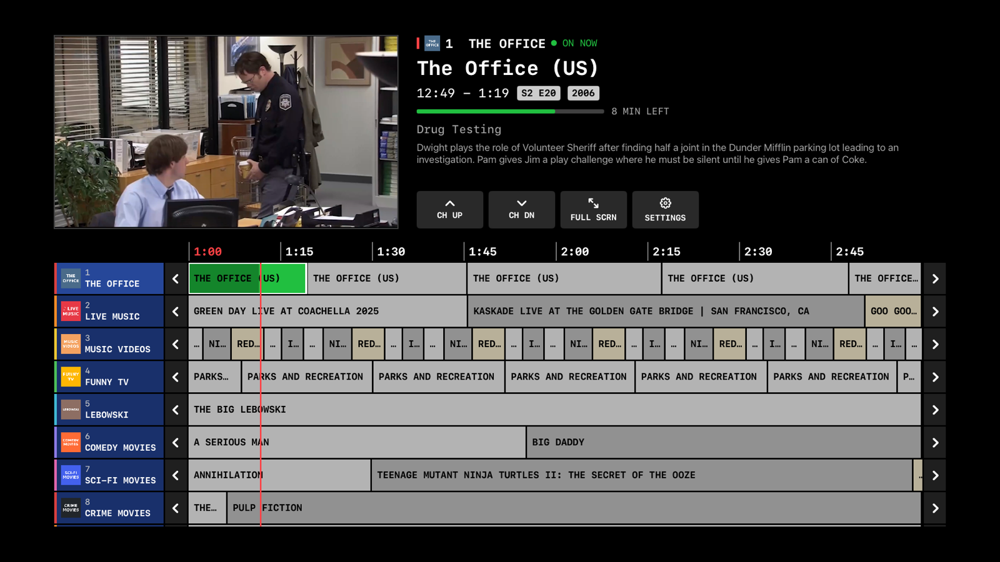
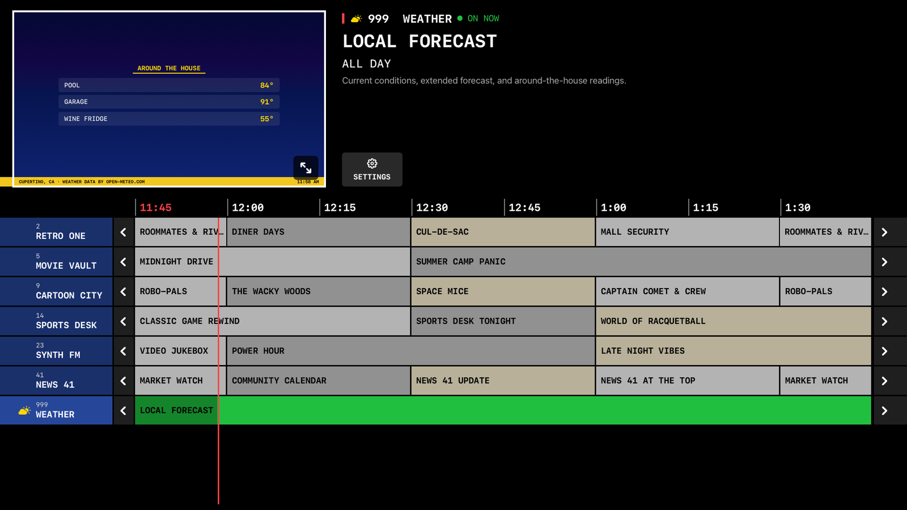

# Basic Cable

> ☕ Enjoying Basic Cable? [Buy me a coffee](https://buymeacoffee.com/dbdmdbdmdbdm) — or, better yet, [donate to the EFF](https://eff.org/donate) to support digital rights.
>
> 🔍 Want to check that the App Store build matches this source? See [VERIFYING.md](VERIFYING.md).

**Basic Cable** is a native Apple TV + iPhone/iPad app for [Tunarr](https://tunarr.com) with a retro cable-guide interface. Browse your virtual channels in a classic EPG grid, see what's on now and next, and watch — all directly from your Tunarr server, with no Plex client or HDHomeRun emulation in the middle.



## Features

- Turns on like a TV: launches straight into fullscreen playing your last-watched channel; press select or Menu for the guide
- Classic channel-guide grid: per-show cell shading (adjacent programs alternate three muted tones; episodes of a show match), per-channel accent stripes, channel logos, red now-line, green "on air" highlight with elapsed-time fill, monospaced retro styling
- Live video preview + program details (episode info, year, synopsis, progress bar with minutes remaining) that follow your focus through the guide
- Full-screen viewing with channel up/down zapping and a retro channel banner
- Guide paging in 30-minute steps, ~12 hours of schedule ahead
- Built-in **weather channel** (channel 999) with a retro "Local on the 8s" style display
- Optional **Home Assistant dashboard channels** (998, extras from 996 down) via the bundled [ha-screencap](ha-screencap) Home Assistant add-on / Docker container
- Optional **photos channel** (channel 997): a slideshow of your [Immich](https://immich.app) favorites with crossfades, a slow Ken Burns drift, side-by-side portrait pairs, and an "on this day"-flavored rotation
- Optional **security cameras channel** (channel 951): every Home Assistant camera live at once in a retro CCTV wall — full-motion HLS straight from HA, no transcoding
- All of the above work **with or without Tunarr** — leave the server URL blank and the app runs on just the built-in channels
- **AirPlay** — send any channel to an Apple TV or AirPlay 2 receiver from the iPhone/iPad fullscreen controls (Apple's own route picker; no third-party SDK)
- **Universal** — one app for Apple TV, iPhone, and iPad; iPad gets a two-pane layout (video preview + program info up top, full guide below), close to the Apple TV experience
- No account, no tracking, no dependencies — one small SwiftUI app talking to your own server

## Requirements

- **A running Tunarr server, optionally** (tested against Tunarr 1.3.x) reachable from your Apple TV over the network. Channels should use Tunarr's default **HLS** stream mode. No Tunarr? Use the "NO TUNARR? USE JUST THE BUILT-IN CHANNELS" path on first run — weather, dashboards, photos, and cameras all work standalone.
- **Apple TV** running tvOS 17 or later (or the tvOS Simulator), and/or an **iPhone/iPad** on iOS 17+ (target `TunarrTViOS` — a universal app: iPhone shows the stacked touch guide, iPad shows a two-pane layout closer to the Apple TV screen; tap a channel to tune, tap the tuned channel or the video preview for fullscreen, on-screen chevrons to zap, AirPlay button in the fullscreen controls).
- To build: a Mac with **Xcode 15+** and [XcodeGen](https://github.com/yonaskolb/XcodeGen) (`brew install xcodegen`).

There is no App Store listing — you build and install it yourself with Xcode (see below).

## Connecting to Tunarr

There is no auto-discovery: on first launch the app asks for your Tunarr server's base URL — the same address you use for the Tunarr web UI, e.g. `http://192.168.1.100:8000`. Use the **TEST** button to verify the connection (it probes `/api/version`), then **SAVE**. The URL is stored on-device in `UserDefaults` and can be changed anytime via the SETTINGS button.

Everything the app does is three plain HTTP calls against that base URL:

| Purpose | Endpoint |
|---------|----------|
| Channel lineup | `GET /api/channels` |
| Guide/schedule data | `GET /api/guide/channels?dateFrom=...&dateTo=...` |
| Video streams | `GET /stream/channels/{channelId}.m3u8` — standard HLS, played natively by AVPlayer |

Notes:

- **Plain HTTP is fine on your LAN.** The app sets the `NSAllowsLocalNetworking` App Transport Security exception, so cleartext HTTP works to private/LAN addresses (RFC-1918 IPs, link-local, and `.local` names) — where most Tunarr servers live. HTTPS URLs work anywhere. If you reach your server via a custom local hostname (e.g. `http://tunarr.home`), use its IP address or HTTPS instead, since ATS still enforces HTTPS for non-`.local` hostnames.
- **No authentication.** Tunarr currently has no auth, so the app sends none. Don't expose your Tunarr server to the internet; if you want out-of-home access, use a VPN (WireGuard/Tailscale).
- **Channel-change latency.** Tuning a channel takes roughly 10–15 seconds while Tunarr spins up the ffmpeg session server-side (a "TUNING" indicator shows during this). This is the same latency any Tunarr client has, including Plex.
- The app is read-only against Tunarr — it never modifies your server's channels or settings.

## Server sizing & troubleshooting

Honest expectations for the box running Tunarr — most "the app is broken" reports are actually the server out of breath:

- **Hardware transcoding is effectively required.** Software ffmpeg on a NAS-class CPU runs slower than realtime on modern sources (constant buffering). Any Intel iGPU with QuickSync/VAAPI (an N100 mini PC is the sweet spot) transcodes at many times realtime.
- **Each tuned channel is one live transcode.** A 4-core N100 handles a few concurrent channels comfortably; it does not handle six. Channel zapping spawns sessions faster than they're reaped — the app throttles this (rapid surfing spawns one session, not one per press), but the budget is still small.
- **4K HDR content is the heavy path.** HDR→SDR tonemapping is the most expensive thing Tunarr does, and on VAAPI-only iGPUs the current release picks a broken pipeline for it ([tunarr#1951](https://github.com/chrisbenincasa/tunarr/issues/1951)). Prefer SDR copies of channel content where you can.
- **"Some channels work, some don't."** That's the server-overload signature, not randomness: already-running streams keep playing while every *new* transcode fails to start. Tunarr ≤1.3.8 makes this worse by leaking the failed sessions' ffmpeg processes, which snowballs ([tunarr#1950](https://github.com/chrisbenincasa/tunarr/issues/1950)). The app shows **SERVER BUSY** over the static when it detects this state (server API answering but the stream repeatedly failing to start) versus **NO SIGNAL** when the server is unreachable — press play/pause to retry. Server-side, the optional [tunarr-watchdog companion](companion/tunarr-watchdog) logs per-channel failures and reaps leaked ffmpeg processes automatically.

## The weather channel



The app adds a synthetic channel **999 WEATHER** to the guide (Tunarr doesn't know about it — it's rendered entirely client-side). Tuning it shows a retro weather display that cycles through current conditions and a 7-day forecast, refreshed every 15 minutes.

**Data sources:**

- **Forecast**: [Open-Meteo](https://open-meteo.com) — free, no API key required. It only needs coordinates, which come from one of:
  - your **Home Assistant** server's configured location (automatic when HA is set up below), or
  - a location entered in Settings — zip code, city name, or `lat, lon` (geocoded on-device via CLGeocoder), or
  - the Apple TV's own location via the "USE THIS APPLE TV'S LOCATION" button (one-time permission prompt; WiFi-based, city-level accuracy).
- **Home Assistant (optional)**: enter your HA URL and a [long-lived access token](https://www.home-assistant.io/docs/authentication/#your-account-profile) in Settings, plus a comma-separated list of sensor entity IDs (e.g. `sensor.outdoor_temp, sensor.pool_temp`). Those readings appear on an extra "AROUND THE HOUSE" page of the weather channel. The token is stored on-device and only ever sent to the URL you configure.

Without any of this configured, the weather channel shows a "set location in settings" notice — the rest of the app is unaffected.

## The Home Assistant dashboard channel

Channel **998 HOME** — and as many more as you like, extras numbered down from 996 — shows your Home Assistant dashboards as TV channels. tvOS has no web engine, so the app can't load a dashboard itself — instead, **ha-screencap** runs headless Chromium on your network, screenshots the dashboards every few seconds, and the app displays the latest frames.

Two ways to run ha-screencap:

- **Home Assistant add-on** (easiest on HA OS): *Settings → Add-ons → Add-on Store → ⋮ → Repositories*, add `https://github.com/dbdmdbdmdbdm/basic-cable`, install **Basic Cable Screencap**, paste a long-lived token, and list your dashboard paths. Snapshots serve at `http://<ha-host>:8090/latest.png`, `/latest/1.png`, … — see [ha-screencap/DOCS.md](ha-screencap/DOCS.md).
- **Docker container** on any box: see [companion/ha-screencap/README.md](companion/ha-screencap/README.md).

Then enter the snapshot URLs in Settings, comma-separated and optionally named (`Kitchen=http://…/latest/1.png`) — each becomes its own channel. They only appear in the guide once configured, and the TEST button fetches every URL and previews the first frame.

Tip: if the dashboard you capture has camera cards, set them to `camera_view: auto` (stills) — at a 10-second snapshot cadence, `live` mode looks identical but keeps the capture container decoding video around the clock.

## The security cameras channel

Channel **951 SECURITY** shows every configured Home Assistant camera at once — a retro CCTV monitor wall with camera labels, a blinking REC dot, and burned-in timestamps. Enter your camera entity ids in Settings (comma-separated, e.g. `camera.front_door, camera.backyard`); per-camera SHOW toggles control what's on the wall, live.

Streams are full-motion HLS fetched per camera over HA's websocket API (`camera/stream`) — HA proxies each camera's own stream, so there's no transcoding and no meaningful server load. For fast channel joins, enable **stream preload** on the cameras (each camera's settings in HA, or the `preload_stream` camera preference) so HA keeps the streams warm; without it every tile waits out HA's cold stream spin-up. The TEST button in Settings verifies each entity and exercises the real stream path.

## The photos channel

Channel **997 PHOTOS** is a shuffled slideshow of your [Immich](https://immich.app) favorites — 12 seconds per photo with a crossfade, a slow Ken Burns drift, and a month/year stamp. Configure it in Settings with your Immich URL and an API key (Immich → Account Settings → API Keys; `asset.read`, `asset.view` and `album.read` permissions are enough). The channel only appears once both are set. Photos stream directly from your Immich server and are never stored.

## Remote controls

**In the guide:**

- Swipe / arrows — move through guide cells; the info panel follows your focus
- Select on a cell — tune that channel
- `<` / `>` cells at row edges — page the guide window ±30 minutes
- CH UP / CH DN / FULL SCRN / SETTINGS buttons above the guide

**In fullscreen:**

- Swipe up/down — channel up/down (shows the channel banner)
- Play/Pause — pause and resume
- Select or Menu — back to the guide

## Building and installing

```bash
git clone <this repo> && cd tunarr-tv
xcodegen generate        # creates TunarrTV.xcodeproj (regenerate after adding source files)
```

**Run in the simulator:**

```bash
xcodebuild -project TunarrTV.xcodeproj -scheme TunarrTV \
  -sdk appletvsimulator -destination 'generic/platform=tvOS Simulator' \
  CODE_SIGNING_ALLOWED=NO build
xcrun simctl boot "Apple TV 4K (3rd generation) (at 1080p)"
xcrun simctl install booted <DerivedData path>/TunarrTV.app
xcrun simctl launch booted com.dbdm.tunarrtv
```

**Install on a real Apple TV:**

1. Open `TunarrTV.xcodeproj` in Xcode.
2. Target **TunarrTV** → Signing & Capabilities → select your Team (edit the bundle identifier in `project.yml` if you fork).
3. Pair the Apple TV: on the TV, Settings → Remotes and Devices → Remote App and Devices; in Xcode, Window → Devices and Simulators (both devices on the same network).
4. Choose the Apple TV as the run destination and press Run.

With a paid Apple Developer account the install is valid for about a year; with a free account it expires after 7 days and needs reinstalling.

## Project layout

- `project.yml` — XcodeGen spec (tvOS 17+, ATS local-networking exception for HTTP on the LAN)
- `TunarrTV/Sources/`
  - `TunarrClient.swift` — the three Tunarr REST calls
  - `Models.swift` — channel/guide models, defensive JSON decoding
  - `AppState.swift` — tuning, guide-window paging, refresh timers, AVPlayer ownership
  - `GuideView.swift` — the EPG grid (focus-driven, 2-hour window, 30-minute paging)
  - `InfoPanelView.swift` — program details + control cluster
  - `PlayerViews.swift` — AVPlayerLayer wrapper + fullscreen player
  - `ContentView.swift`, `Theme.swift`, `SettingsView.swift`
- `TunarrTV/Resources/` — bundled fonts (OFL, see `Fonts/LICENSES.md`) and demo-mode video: the demo channels play short, self-generated ffmpeg test-pattern clips (color bars, cartoon, static, synthwave) — no third-party video is included.

## License

MIT — see [LICENSE](LICENSE).
